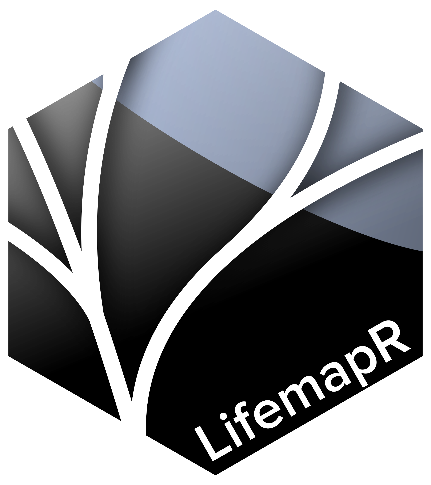

# LifemapR 

## Overview

An R package to visualise datas on a Lifemap base (https://lifemap-ncbi.univ-lyon1.fr/) 

## Installation

To install the development version of <code>LifemapR</code> from GitHub :
```r
remotes::install_github("cbompard/LifemapR")
```
Once installed, load the package with :
```r
library("LifemapR")
```


## Usage

Here is a brief introduction on how to use LifemapR.

1. With the ```build_Lifemap``` function transform your already existing datas into a format usable by LifemapR functions

```r
df <- read.csv("data/taxids_example.txt", row.names = 1)

# Construction of a LifemapR usable dataframe
LM_obj <- LifemapR::build_Lifemap(df)
```
After the ```build_Lifemap``` function the result is a LifemapR format containing a dataframe and the name of the basemap chosen. These elements are accessible as following :
```r
full_df <- LM_obj$df
basemap <- LM_obj$basemap
```

2. Then you can display a map with wanted informations either by calling one of ```LifemapR``` functions or by calling ```leaflet``` functions \
- The use of basics ```leaflet``` functions is recommended for simple information displaying such as adding a marker to the required taxids ... \
However, please note that it should only be used for small data sets.
```r
# Note that even when using leaflet functions, you need to use the LifemapR display_map function
LifemapR::display_map(df=LM_obj$df[LM_obj$df$type == "requested",], m=LM_obj$basemap) %>% 
    addMarkers(~lon,~lat,label=~sci_name)

# or

m <- LifemapR::display_map(df=LM_obj$df[LM_obj$df$type == "requested",], map=LM_obj$basemap) 
leaflet::addMarkers(m, ~lon,~lat,label=~sci_name)
```

- The use of ```LifemapR``` function is recommended for all the other operations.\
Note that with the ```LifemapR``` functions, a ```shiny``` application will be launched

```r
# A LifemapR function
LifemapR::draw_subtree(LM_obj)
```


## Development

Functions : 
- [x] Display The Lifemap base (choice between 'fr' and 'ncbi') -> display_map()
- [x] Transform the given dataframe to a format usable by future functions -> construct_dataframe() 
- [x] Display the trace between TaxIDs 
    - \+ [ ] generate a Newick subtree
- [x] Represent continuous datas (like GC-content) with Shiny -> add_Lifemap_markers()
- [x] Passing information along the branches -> pass_infos()
- [ ] Represent discret datas (like Status in the NCBI data format)


### How to use during development

Go to the package's folder

```r
library(devtools)
devtools::load_all()
```
then you can simply use the package's functions