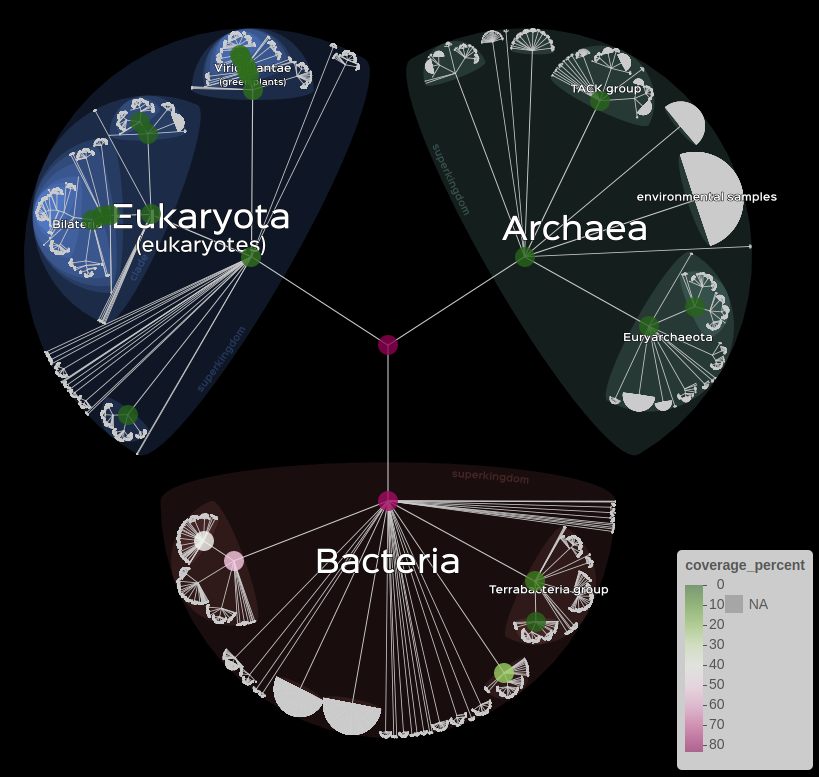
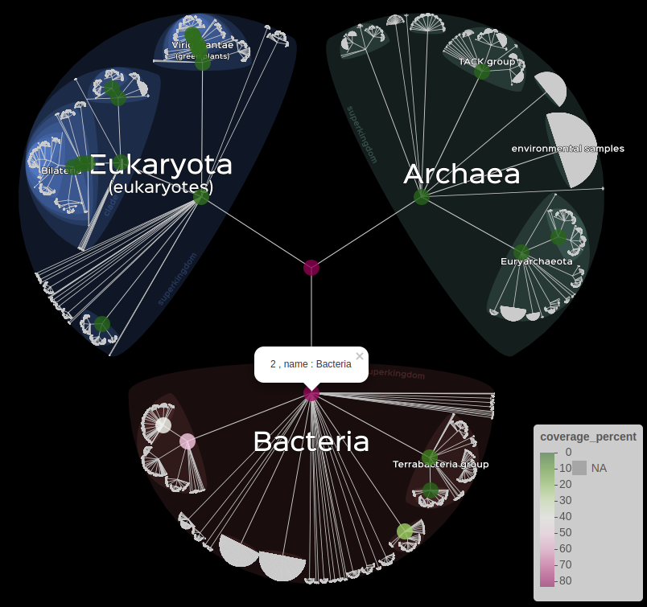
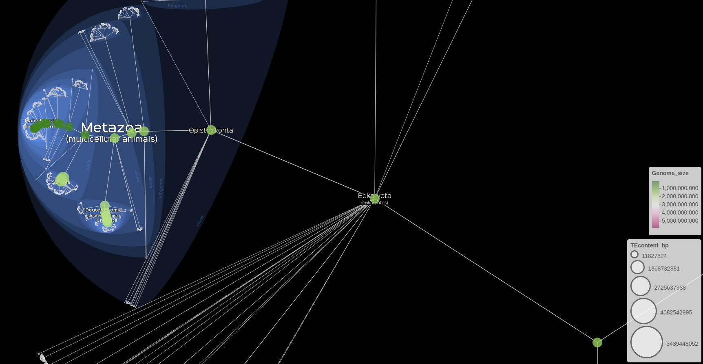
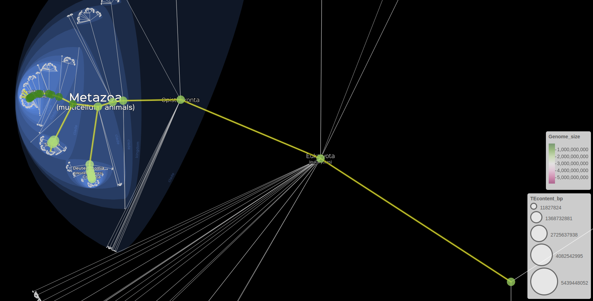
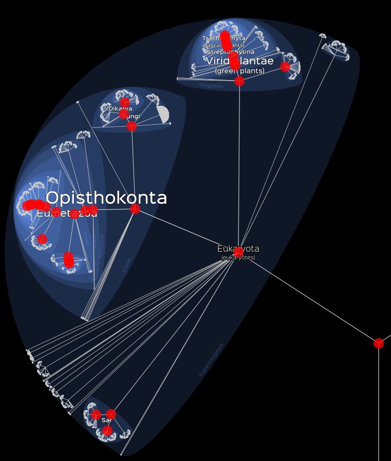
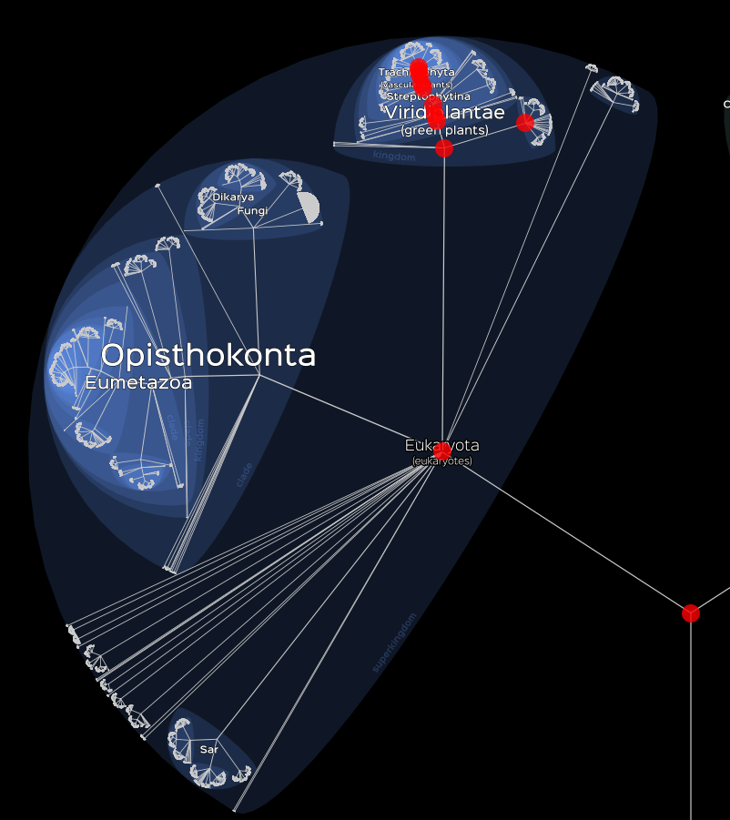
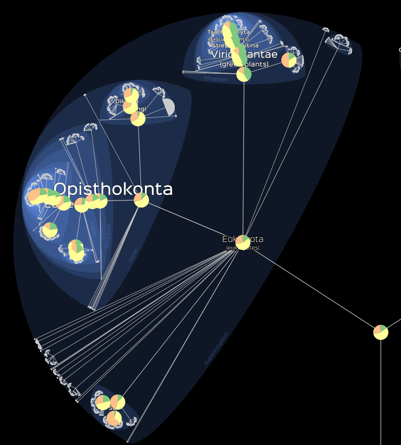

```{r setup, include=FALSE}
knitr::opts_chunk$set(echo = TRUE)
```

Introducing LifemapR, a package aiming to visualise data on a Lifemap basemap. The uniqueness of LifemapR is that it offers interactive visualization of data across a vast taxonomy (the NCBI taxonomy). LifemapR can easily process large datasets, exceeding 300,000 rows, with remarkable efficiency and precision. 
But what sets LifemapR apart is its flexibility and adaptability, offering a wide spectrum of customization options. This allows users to personalize their data visualization to better suit their unique needs and preferences. 


# Installation

1. Install the development version of `LifemapR` from GitHub

```{r install, eval = FALSE}
remotes::install_github("Lifemap-ToL/LifemapR")
```

2. Once installed, the package can be loaded with : 
```{r load, eval = FALSE}
require("LifemapR")
```

# Usage

## General case

The very first step to use this package is to have a dataframe containing at least a ```taxid``` column containing NCBI format TaxIds. This dataframe can also contain other data that you might want to visualise.

```{r buildLF, eval = TRUE, echo = FALSE, results = FALSE, warning = FALSE}
require("LifemapR", quietly = TRUE)

data(eukaryotes_1000)
LM_eukaryotes <- build_Lifemap(eukaryotes_1000)
```

```{r printLF, eval = TRUE, echo = FALSE}
if (is.lifemap_obj(LM_eukaryotes))
  LM_eukaryotes$df[6:10, 1:5]
```

You can then transform this dataframe into a format suitable for the visualisation functions of the package with the ```build_Lifemap``` function.\

```{r, eval = FALSE}
require("LifemapR")

LM <- build_Lifemap(data)
```

After that, you get a ```lifemap```  object that takes the form of a list containing the following informations :

- ```df``` : containing the augmented dataframe obtained after the first step.

You can then visualise your data with ```lifemap()``` associated with one or more of the following functions :

- ```lm_markers()```, to represent data as circles.
- ```lm_branches()```, to represent the data's subtree.
- ```lm_discret()```, to represent discret data as piecharts.

Each one of these three function adds a layer to the visualisation. These layers are combined with the ```+``` symbol.

```{r, eval = FALSE}
# Example with default representation

# one layer
lifemap(LM) + lm_markers()

# three different layers 
lifemap(LM) + lm_markers() + lm_branches()
```

These function also allow the user to represent data by modifying characteristics of representations as we'll see later in the examples.

The output is a shiny interface where the user can move and zoom freely.


Please note that the following examples have been done in may 2023, if you try them you may not have the same values due to database update

## Analyse of Kraken2 results

This dataset is the result of a classification by Kraken (Derrick E. Wood, J. Lu, 2019) on a metagenomic sample coming from a controlled set of 12 known bacterial species (V. Sevim, J. Lee, 2019).

First of all, we load the data and transform it into the LifemapR format.

```{r, eval = FALSE}
data(kraken_res)

LM_kraken <- build_Lifemap(df = kraken_res)
```

Then we can began to visualise our data.

We can for example represent the number of read that was assigned to each TaxID by the color of the markers with the following command.

```{r, eval = FALSE}
lifemap(LM_kraken) + 
  lm_markers(var_fillColor = "coverage_percent", fillColor = "PiYG")
```

```{r includekrakenfig1, eval = TRUE, echo = FALSE, out.width = "40%", out.height = "20%", fig.cap = 'Visualisation of kraken data', fig.show = 'hold', fig.align = 'center'}

``` 

With this representation, the markers are displayed if the if the associated node is close enough.

It is possible to change the way markers are displayed with the ```display``` argument.

```{r, eval = FALSE}
# All the nodes that were requested by the user.
lifemap(LM_kraken) + 
  lm_markers(var_fillColor = "coverage_percent", fillColor = "PiYG", display = "requested")

# Only the nodes that have no descendants.
lifemap(LM_kraken) + 
  lm_markers(var_fillColor = "coverage_percent", fillColor = "PiYG", display = "leaves")

```

```{r includekrakenfig2, eval = TRUE, echo = FALSE, out.width = "40%", out.height = "20%", fig.cap = 'left : display = "requested", right : display = "leaves"', fig.show = 'hold', fig.align = 'center'}
knitr::include_graphics(c("figures/kraken_requested.png", "figures/kraken_leaves.png"))
``` 

Informations can also be displayed for the user with the ```popup``` or ```label``` arguments.

```{r, eval = FALSE}
# When clicking on a node, display the desired information.
lifemap(LM_kraken) + 
  lm_markers(var_fillColor = "coverage_percent", fillColor = "PiYG", popup = "name")
```

```{r includekrakenfig3, eval = TRUE, echo = FALSE, out.width = "40%", out.height = "20%", fig.cap = 'Usage of the ```popup``` argument', fig.show = 'hold', fig.align = 'center'}

``` 

Finally, it is also possible to represent data with a subtree, either by the size of the branches or their color.

```{r, eval = FALSE}
# Information on branche's color.
lifemap(LM_kraken) + 
  lm_branches(var_color = "coverage_percent", color = "PiYG")

# Information on branche's size.
lifemap(LM_kraken) + 
  lm_branches(size = "coverage_percent")
```

```{r includekrakenfig4, eval = TRUE, echo = FALSE, out.width = "45%", out.height = "30%", fig.cap = "left : branche's color, right : branche's size", fig.show = 'hold', fig.align = 'center'}
knitr::include_graphics(c("figures/kraken_branches_color.png", "figures/kraken_branches_size.png"))
``` 


## Comparative genomic data on genome sizes and transposable elements 

This dataset contains informations about the genome size and the Transposable Elements content for molluscs, insects and vertebrates.

First of all, we load the data and transform it into the LifemapR format.

```{r, eval = FALSE}
data(gen_res)
LM_gen <- build_Lifemap(df = gen_res)
```

Then we can began to visualise our data.

Here we have two characteristics to visualise, we can do so with the following command.

However, unlike the precedent data set, we don't have informations for all the nodes. 
Here we only have data for the leaves so it will be necessary to infere values to the nodes where the information is missing with the ```FUN``` argument.

```{r, eval = FALSE}
# Visualisation of the Genome size on the fillColor and the TEcontent on the size of markers.
lifemap(LM_gen) + 
  lm_markers(var_fillColor = "Genome_size", fillColor = "PiYG", radius  = "TEcontent_bp", FUN = mean)
```

```{r includegenfig, eval = TRUE, echo = FALSE, out.width = "100%", out.height = "20%", fig.cap = 'Visualisation of genomics data', fig.show = 'hold', fig.align = 'center'}

``` 

We can also represent markers and subtree at the same time 

```{r, eval = FALSE}
# Visualisation of the Genome size on the fillColor and the TEcontent on the size of markers.
lifemap(LM_gen) + 
  lm_branches() +
  lm_markers(var_fillColor = "Genome_size", fillColor = "PiYG", radius  = "TEcontent_bp", FUN = mean) 
```

```{r includegenmarkfig, eval = TRUE, echo = FALSE, out.width = "100%", out.height = "20%", fig.cap = 'Visualisation of genomics data with markers and subtree', fig.show = 'hold', fig.align = 'center'}

``` 


## Dataset of eukaryotes from NCBI database

This dataset contains informations about around 1 000 eukaryotes randomly fetched from the NCBI database.

First of all, we load the data and transform it into the LifemapR format.

```{r, eval = FALSE}
data(eukaryotes_1000)
LM_eukaryotes <- build_Lifemap(df = eukaryotes_1000)
```

Then we can began to visualise our data.

```{r, eval = FALSE}
# Visualisation of eukaryotes data.
lifemap(LM_eukaryotes) + 
  lm_markers()
```

```{r includeeukaryotefig1, eval = TRUE, echo = FALSE, out.width = "50%", out.height = "20%", fig.cap = 'Basic visualisation', fig.show = 'hold', fig.align = 'center'}

``` 

We can also choose to visualise only a part of our data. To do this, we can either sort our data in advance or use the ```data``` argument to do so.

```{r, eval = FALSE}
# Visualisation of Plants.
lifemap(LM_eukaryotes) + 
  lm_markers(data = LM_eukaryotes$df[LM_eukaryotes$df$Group %in% "Plants", ])
```

```{r includeeukaryotefig2, eval = TRUE, echo = FALSE, out.width = "50%", out.height = "20%", fig.cap = 'Visualisation of Plants', fig.show = 'hold', fig.align = 'center'}

``` 

Finally we can visualise discret variables with the ```lm_piechats()``` function as following.

```{r, eval = FALSE}
# Visualisation of the maximum assembly level.
lifemap(LM_eukaryotes) + 
  lm_piecharts(param = "Group")
```

```{r includeeukaryotefig3, eval = TRUE, echo = FALSE, out.width = "50%", out.height = "20%", fig.cap = 'Visualisation of the maximum assembly level', fig.show = 'hold', fig.align = 'center'}

``` 
